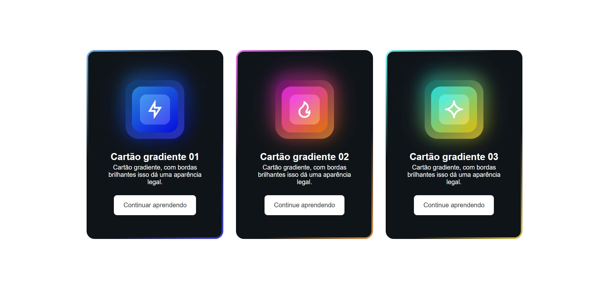
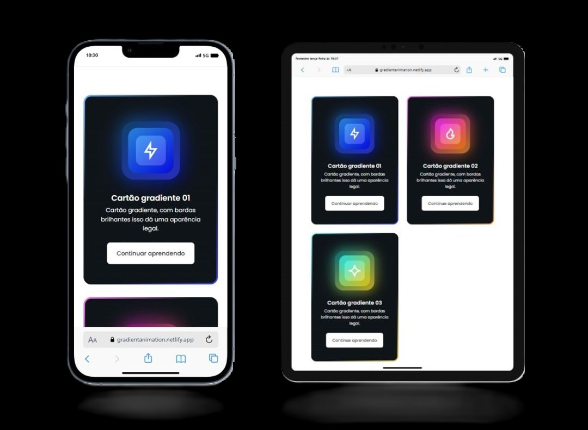

Projeto de cartões com gradientes

&nbsp;
&nbsp;
&nbsp;

Este é um projeto de cartões desenvolvido utilizando HTML, CSS e SCSS para criar um conjunto de cartões com gradientes. Esses cartões são totalmente responsivos, proporcionando uma experiência visualmente agradável em dispositivos de diferentes tamanhos.

<a href="https://gradientanimation.netlify.app/"><strong>Demonstração ao vivo</strong></a>

<b>Tecnologias Utilizadas:</b>

HTML5: 

Utilizado para a estruturação do conteúdo dos cartões.

CSS3 e SCSS: 

Utilizados para estilização dos elementos e aplicação dos gradientes.

Estrutura do Projeto:

O projeto consiste em um arquivo HTML (index.html) e um arquivo de estilo CSS (styles.css) gerado a partir do SCSS. A estrutura básica do HTML inclui um contêiner principal (container) que envolve todos os cartões. Cada cartão é representado por um artigo (article) com classes específicas para aplicação dos gradientes e estilos.

Estrutura do HTML:

Cada cartão é representado por um article com uma classe específica (card__article).
Os elementos visuais, como ícones e formas de gradiente, são adicionados dentro de cada cartão.
Cada cartão contém um título (card__title), uma descrição (card__description) e um botão (card__button).
Estilos e Gradientes

Os gradientes são aplicados utilizando propriedades CSS como background-image e linear-gradient. Cada cartão possui uma combinação única de cores e estilos de gradiente para criar uma aparência visualmente atraente. Além disso, são utilizadas classes adicionais para aplicar efeitos de escala (card__scale-1 e card__scale-2) e formas geométricas (card__shape-1, card__shape-2 e card__shape-3).

Responsividade:

O projeto foi desenvolvido com foco na responsividade, garantindo que os cartões se ajustem e mantenham uma boa aparência em dispositivos de diferentes tamanhos, desde smartphones até desktops. Isso é alcançado através do uso de unidades relativas e media queries para adaptar os estilos conforme necessário.

Como utilizar:

Para utilizar este projeto, basta incluir os arquivos HTML e CSS em seu projeto. Você pode personalizar os gradientes, estilos e conteúdo dos cartões conforme sua necessidade. Além disso, você pode estender este projeto adicionando mais cartões ou modificando a estrutura e estilos conforme desejado.

Sinta-se à vontade para explorar, modificar e utilizar este projeto de cartões com gradientes em seus próprios projetos!

 <b>Contato:</b>

Se você quiser entrar em contato comigo, sinta-se a vontade.
 

 
 
